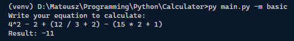
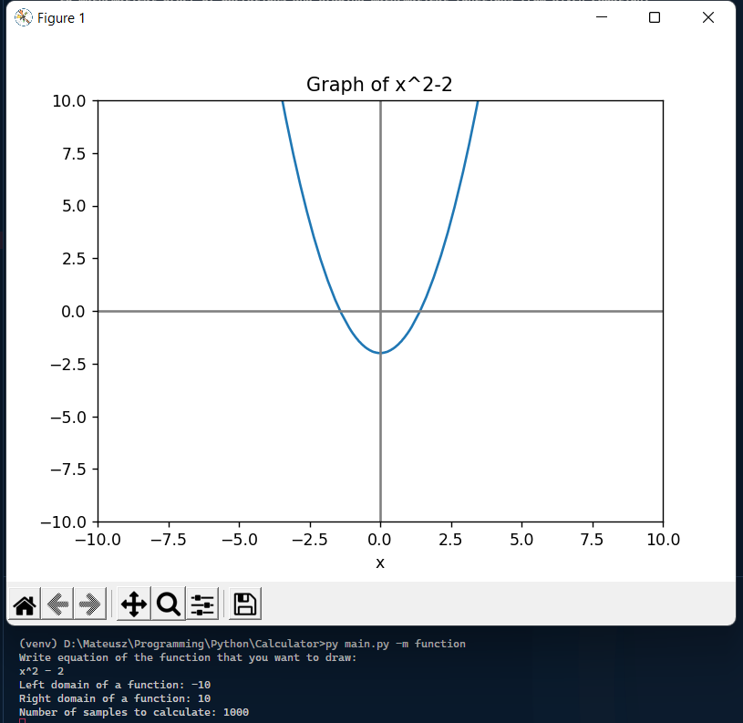

# Dual-purpose Calculator
*There is less grain of sand on a desert than calculators created by programmers*

## About
Dual-purpose Calculator can calculate simple operations as *3 * 2 + (5^2 + 1) / 2* sticking to mathematical order of operations and draw mathematical functions from given equation.

## Usage
Usage differ depending on mode that has to be used:

### Basic mode
To use basic mode (allowing to calculate simple operations) use command:
```
py main.py -m basic
```

### Function mode
To use function mode (allowing to draw function from given equation using matplotlib library) use command:
```
py main.py -m function
```

**Further help can be reached by using help command.**

## Help
Help provides more detailed description of the modes and available commands. To check help use command:
```
py main.py -h
```

## Requirements
Libraries needed to successfully run the program are listed in the *requirements.txt* file.

## Gallery

### Basic mode example


### Function mode example
