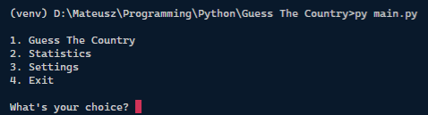
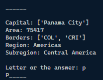
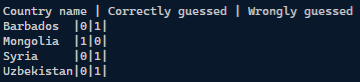
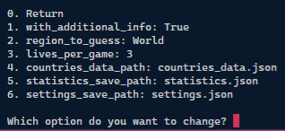

# Guess The Country
*Always wanted to discover some countries with names so hard that they even couldn't be memorized? In this game you can do it!*

## About
Guess The Country is a simple console game based on the hangman game.

## Usage
To turn on the game use the command:
```
py main.py
```

## Short guide
### Menu
Menu contains the four elements:
- "Guess The Country" - starts the game
- "Statistics" - shows the statistics
- "Settings" - allows to edit few settings
- "Exit" - as the name suggests, it exits the game



### Guess The Country
It's the actual game. Game draws random country (from the provided countries data) and the player goal is to guess what country was drawn by providing letters to reveal the country's common name. If player is certain about the country's name then it can be guessed by writing the full answer.



### Statistics
As the name suggests, it shows the statistics of the guessed and not guessed countries with the times specific country was/wasn't guessed.



### Settings
It allows to change six default settings:
- "with_additional_info" - changes whether additional info about the guessed country should be shown (such as capital, area etc.)
- "region_to_guess" - changes region from which the guessed countries will be taken
- "lives_per_game" - changes number of lives (mistakes player can make) per every game
- "countries_data_path" - as the name suggests, it changes the path to the countries data (data used to draw countries and their data)
- "statistics_save_path" - changes save path for the statistics data (path and file will be created if they don't exist)
- "settings_save_path" - changes save path to copy the current settings (note that the only one accepted settings file path will be "settings.json")



### Exit
It simply exits the game.

## Requirements
Script/Game doesn't need any additional Python's libraries (it uses only the built-in ones).

Script/Game needs countries data to successfully run the game. The one used while creating this game was taken from the [https://github.com/mledoze/countries](https://github.com/mledoze/countries).

## Script/Game state
**Script/Game is generally finished and the only updates it can receive will be related to the found bugs.**