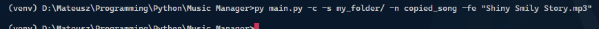

# Music Manager
*Isn't it fun that I made this script only to join some audio files...*

## About
Music Manager is a simple Python script that allows to join, play, copy and modify audio files in simple manner.

## Usage
Usage differs depending on the "mode" (join/play/copy/modify) that has to be used:

### Join
Join command -j allows to join multiple audio files into one. Simple usage:
```
py main.py -j first_file.mp3 second_file.mp3
```

To join all audio files from one folder simply use:
```
py main.py -j -f path_to_folder/
```

### Play
Play command -p allows to play one or many audio files. Usage:
```
py main.py -p file_one.mp3 file_two.wav
```

To play all audio files from the given folder in randomized order use:
```
py main.py -p -r -f path_to_folder/
```

### Copy
Copy command -c as the name suggests allows to copy file. Usage:
```
py main.py -c file_to_copy.mp3
```

To change save path and name of the output file use:
```
py main.py -c -s my_folder/ -n copied_file -fe file_to_copy.mp3
```

### Modify
Modify command -m allows to modify audio file settings (and then save that file). Usage:
```
py main.py -sp 1.2 -fe file_to_modify.mp3
```
*(Above command modifies and exports file that is 1.2 times faster than the original one)*

To change the default save path and file of the output file add to above:
```
py main.py -s my_folder/ -n my_modified_file -sp 1.2 -fe file_to_modify.mp3
```

**Further help can be reached in the -h (help) command.**

### Help
Help provides more detailed description of the commands and arguments which each of them provides. Usage:

```
py main.py -h
```

To check more information about join command use:
```
py main.py -h join
```

## Requirements
Libraries needed to successfully run the script are listed in the *requirements.txt* file.

In order for script to properly run, ffmpeg needs to be installed and added to PATH: [https://ffmpeg.org/](https://ffmpeg.org/)

## Gallery

### Join command example


*Results in creation of file:*


### Play command example


*I can't show how, but music is playing now*

### Copy command example


*Results in creation of file:*


### Modify command example


*Results in creation of file:*


## Scripts state
**There are some errors which should be repaired, but overall script should be working and can be expanded in any time. Finished.**